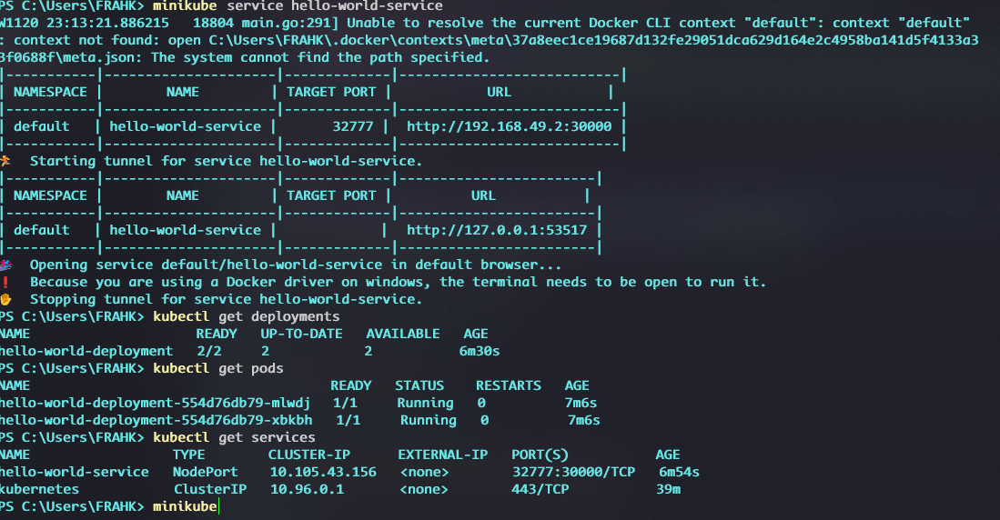
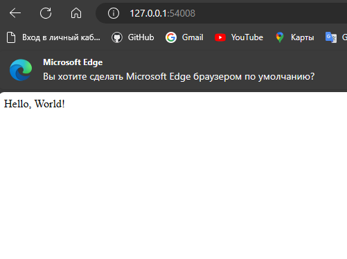

### 3. Сборка и публикация контейнера в Docker Hub

**Шаги:**

1. **Создание Dockerfile:**
   Создайте файл `Dockerfile` в той же директории, что и ваше приложение. Примерный Dockerfile:

```Dockerfile

#Stage 1: Builder
FROM python:3.9 AS backend-builder

WORKDIR /app
COPY requirements.txt ./
COPY . .

# Stage 2: Final Image
FROM python:3.9-slim-buster

WORKDIR /app

COPY --from=backend-builder /app /app
RUN pip install --no-cache-dir -r requirements.txt
EXPOSE 32777

CMD ["python", "app.py"]
```

2. **Создание и тестирование образа:**

   - Откройте терминал или командную строку.
   - Перейдите в директорию с вашим приложением и Dockerfile.
   - Соберите образ Docker: `docker build -t hello-world-app .`
   - Запустите контейнер: `docker run -p 32777:32777 hello-world-app`
   - Проверьте, работает ли приложение, открыв в браузере `http://localhost:32777`.

3. **Публикация в Docker Hub:**
   - Войдите в Docker Hub в терминале: `docker login`.
   - Переименуйте свой образ для Docker Hub: `docker tag hello-world-app [ваше имя пользователя на Docker Hub]/hello-world-app`
   - Отправьте образ в Docker Hub: `docker push [ваше имя пользователя на Docker Hub]/hello-world-app`


### 4. Установка Minikube

**Шаги:**

1. Перейдите на официальную страницу Minikube: [Minikube Installation](https://minikube.sigs.k8s.io/docs/start/).
2. Следуйте инструкциям для установки Minikube на вашу операционную систему.
3. После установки запустите Minikube с помощью команды: `minikube start`.

### 5. Запуск Deployment с 2 репликами

```bash
kubectl apply -f deployment.yaml
```

### 6. Запуск Сервиса

```bash
kubectl apply -f service.yaml
```

### 7. Проброс портов и доступ через веб-браузер

```bash
minikube service hello-world-service
```

Эта команда автоматически откроет веб-браузер с нашим приложением.



**Запущенное приложение** 

